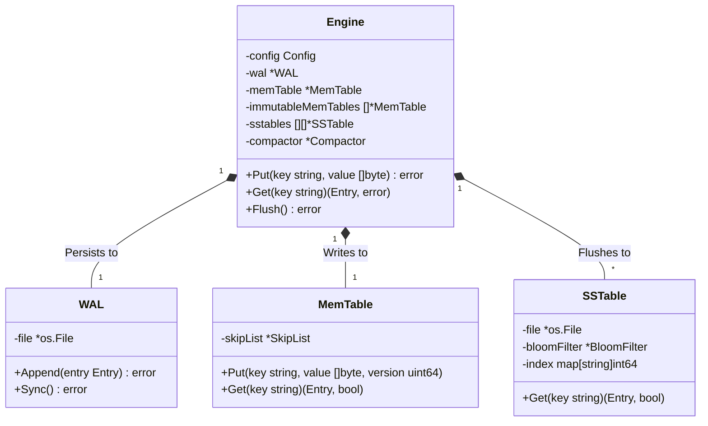
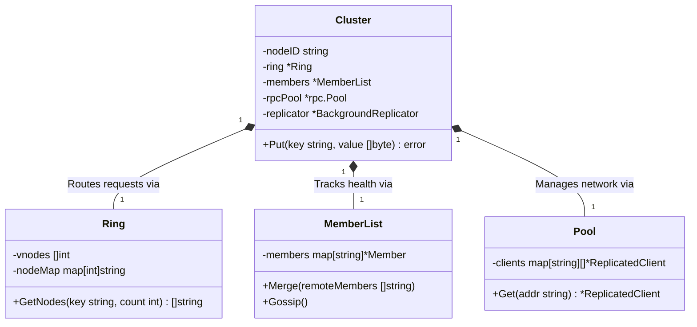
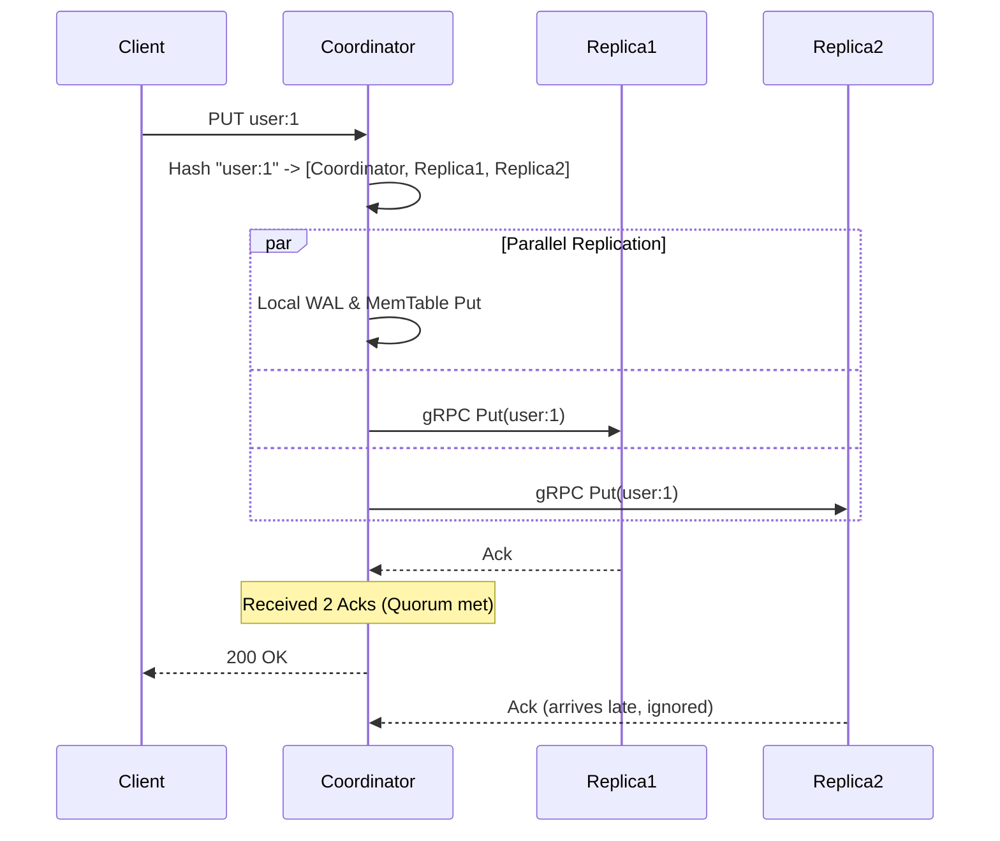
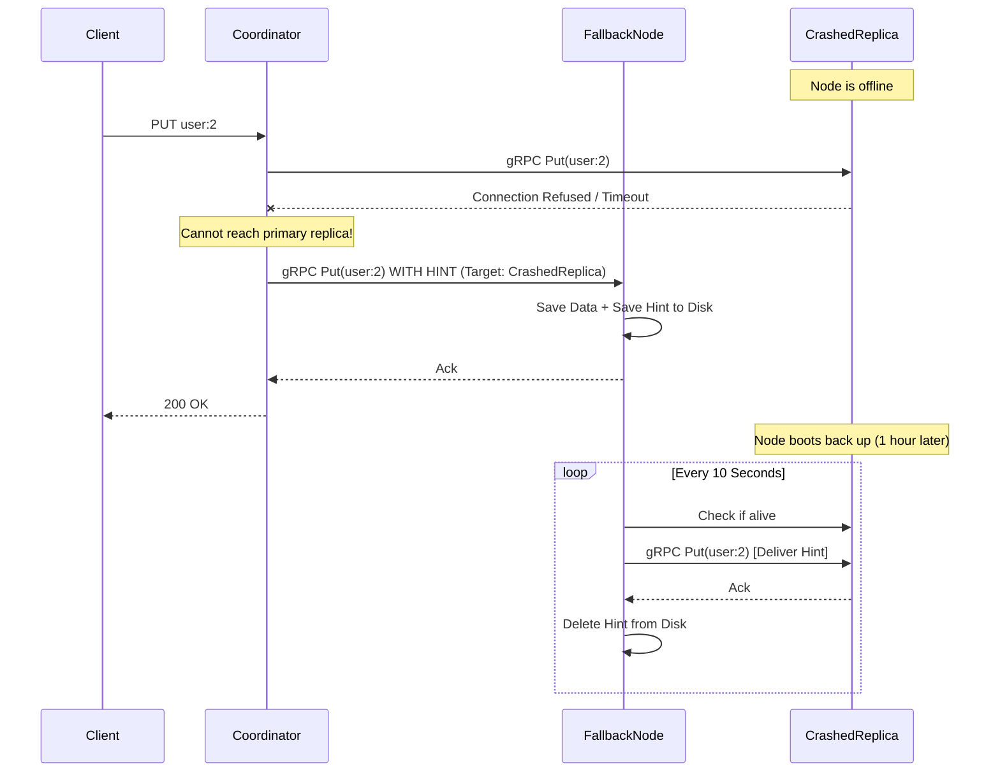
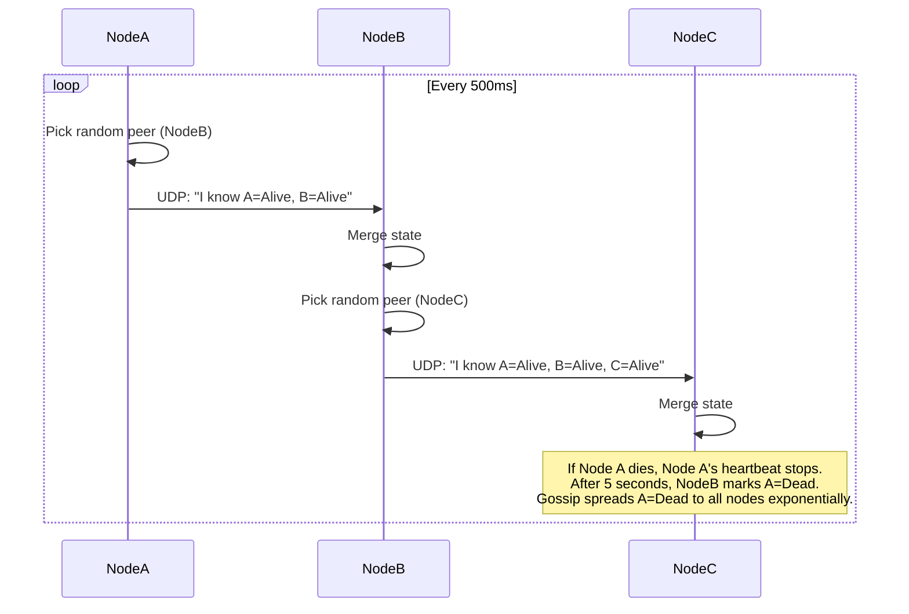
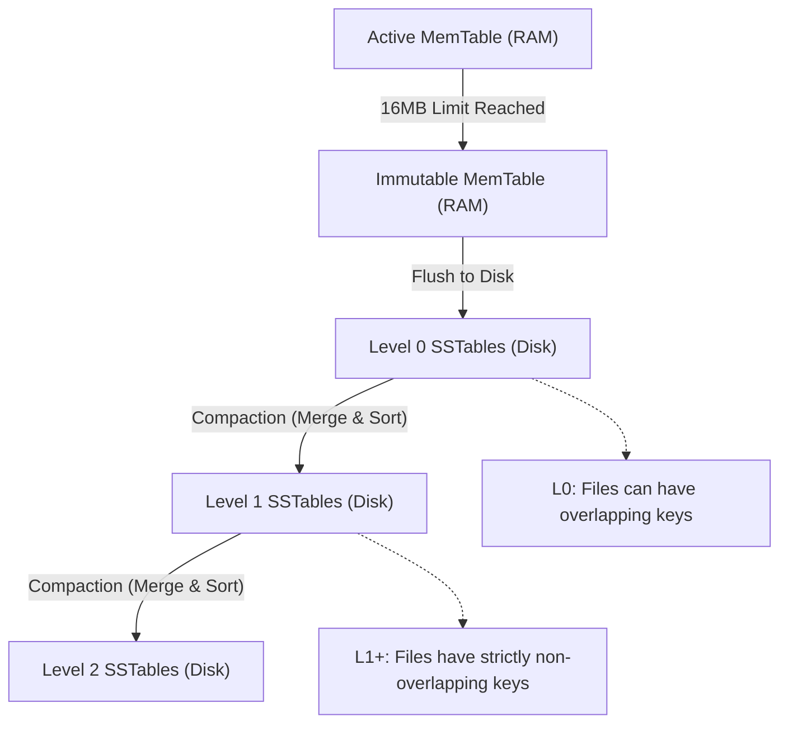
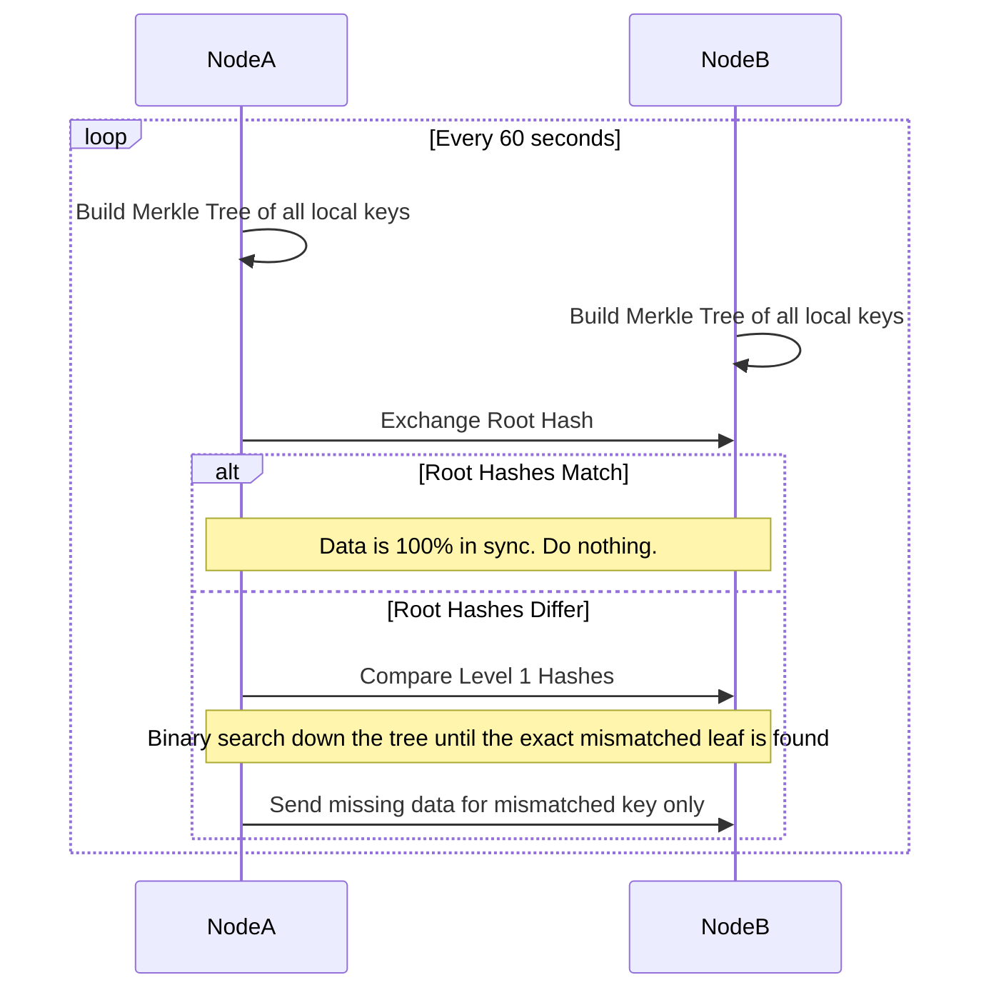
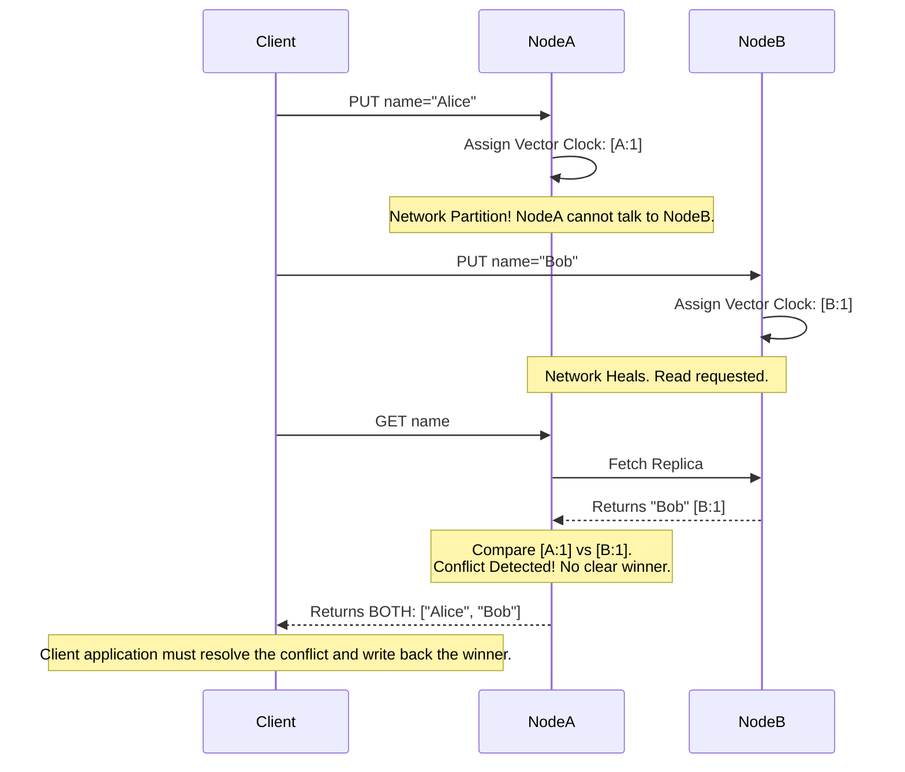
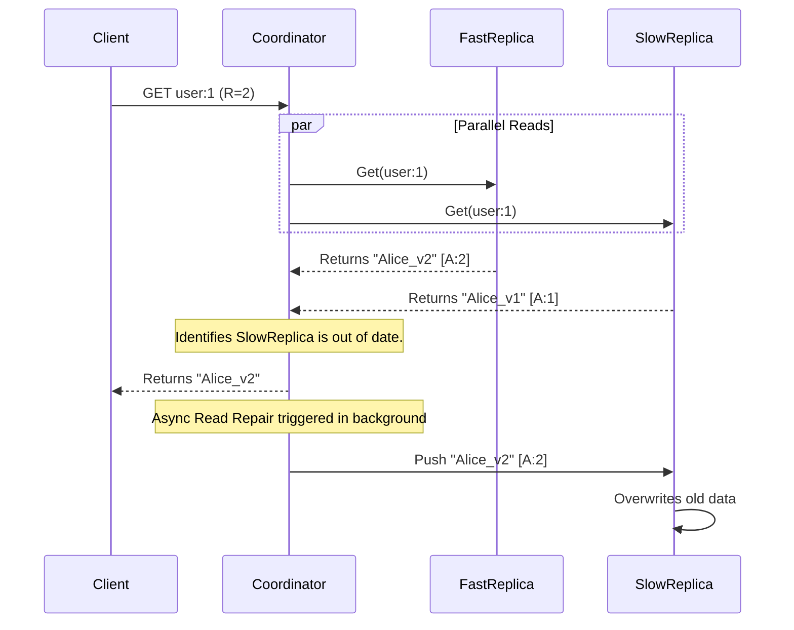

# Kasoku Complete UML & Sequence Diagrams

This document contains Mermaid UML diagrams representing the core architecture and complex workflows of Kasoku.

## 1. Storage Engine (LSM-Tree) Architecture
*Shows the physical storage layout on a single node.*

## 2. Distributed Cluster Architecture
*Shows the network layer and internal cluster services.*

## 3. Standard Write Flow (Quorum=2)
*Shows a successful parallel write to multiple nodes.*

## 4. Failure Recovery: Hinted Handoff
*Shows what happens when a node crashes during a write.*

## 5. Background Consistency: Gossip Protocol
*Shows how the cluster detects dead nodes without a master server.*

## 6. Storage Engine: LSM Compaction
*Shows how the background compactor cleans up the physical disk to prevent reads from slowing down.*

## 7. Anti-Entropy: Merkle Tree Sync
*Shows how nodes silently fix missing data using cryptographic hashes.*

## 8. Version Control: Vector Clocks
*Shows how Kasoku handles conflicting writes from different nodes without a master server.*

## 9. Self-Healing: Read Repair
*Shows how the database fixes stale data on the fly during a user's read request.*

