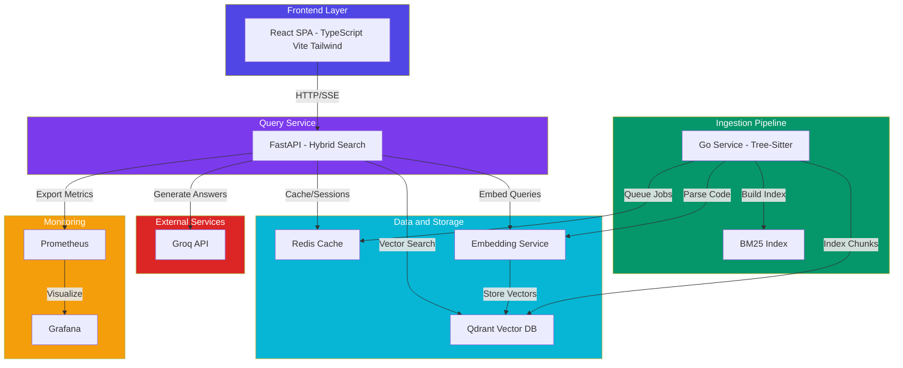
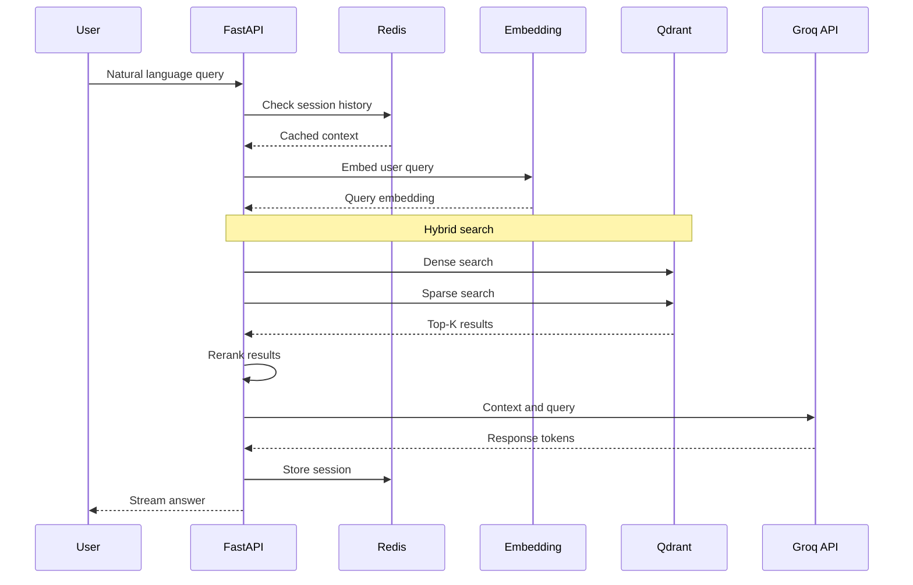
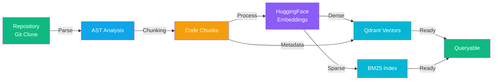

# Manthan: Semantic Code Search Engine

A production-grade, self-hosted semantic code search engine that enables natural language queries across entire codebases. Ask questions like "How does authentication work?" and receive synthesized answers with exact file paths and line number citations.

## Overview

Manthan is a retrieval-augmented generation (RAG) system designed specifically for code understanding and navigation. Unlike traditional grep-based search or keyword indexing, Manthan uses hybrid search combining dense vector embeddings with sparse BM25 retrieval, cross-encoder reranking, and LLM-powered answer generation to provide semantic understanding of codebases.

### Key Capabilities

- Natural language code search across multiple repositories
- Hybrid search combining dense embeddings and sparse BM25 indices
- Automatic AST-based code chunking for optimal context windows
- Cross-encoder reranking for improved relevance
- LLM-powered query expansion and answer synthesis
- Session-based chat with persistent conversation history
- Real-time streaming responses
- Complete observability with Prometheus and Grafana
- Self-hosted architecture with no external dependencies

### Use Cases

- New engineer onboarding: Understand unfamiliar codebases rapidly
- Code review assistance: Find all related functions and dependencies
- Security audits: Discover sensitive data handling patterns semantically
- Legacy code archaeology: Understand business logic without original documentation
- Architectural analysis: Map component relationships and data flows
- Open source contribution: Navigate large unfamiliar projects before submitting PRs

## Architecture

### System Components



### Data Flow



### Ingestion Pipeline



## Tech Stack

| Component | Technology | Rationale |
|-----------|-----------|-----------|
| Ingestion Service | Go 1.21+ | Goroutine concurrency model, tree-sitter bindings, optimal parallelization for AST parsing |
| Query API | Python 3.11+, FastAPI | Python ML/AI ecosystem, native async/await, server-sent events for streaming |
| Embeddings | HuggingFace Transformers | Open source, self-hosted, all-MiniLM-L6-v2 for efficiency |
| Vector Database | Qdrant | Rust foundation, hybrid search (dense+sparse), named vectors, advanced filtering |
| Cache & Queues | Redis 7+ | High-performance string k-v store, streams for async decoupling |
| Sparse Search | BM25 | Proven lexical search, handled by Qdrant sparse vectors |
| Reranking | cross-encoder | Open source, self-hosted semantic reranking |
| LLM Backend | Groq API | High-speed token generation, optional local alternatives |
| Frontend | React 18, TypeScript, Vite, Tailwind CSS | Modern SPA framework, type safety, fast builds, utility-first CSS |
| Observability | Prometheus, Grafana | Industry-standard metrics, self-hosted, minimal overhead |
| Orchestration | Docker Compose | Local development and production deployment |

## Prerequisites

### System Requirements

- CPU: 4+ cores recommended (2 minimum for development)
- Memory: 8GB minimum (16GB+ recommended for larger codebases)
- Disk Space: 50GB+ for Qdrant vector store and Redis persistence
- Network: Outbound HTTPS for LLM API calls (Groq)

### Software Requirements

- Docker 20.10+ and Docker Compose 2.0+
- Go 1.21+ (for modifying ingestion service)
- Python 3.11+ (for modifying query API or embedding service)
- Node.js 18+ and npm 9+ (for frontend development)
- Git 2.30+

### API Keys

- Groq API Key: Required for LLM operations. Obtain from https://console.groq.com
  - Free tier includes sufficient quota for development and testing
  - Set via environment variable `GROQ_API_KEY`

## Quick Start

### Prerequisites

- Docker Desktop 20.10+ (with at least 4GB memory allocated)
- A Groq API key from https://console.groq.com

### 1. Environment

Create a `.env` file in `codesearch/.env`:

```bash
GROQ_API_KEY=gsk_your_key_here
# Optional additional keys for higher rate limits:
# GROQ_API_KEY_2=gsk_your_key_2
# GROQ_API_KEY_3=gsk_your_key_3
```

### 2. Build

```bash
cd codesearch
docker compose build
```

### 3. Launch

```bash
docker compose --env-file .env up -d
```

All 8 services will start. Initial startup takes ~60s (model downloads, slow imports).

### 4. Verify

```bash
curl http://localhost:8000/api/health
# {"status":"ok","service":"codesearch-api"}
```

### Quick Search

```bash
curl -X POST http://localhost:8000/api/search \
  -H "Content-Type: application/json" \
  -d '{"query":"how does WAL work"}'
```

### Ingesting a Repository

Clone a repo into `codesearch/repos/target/`:

```bash
cd codesearch/repos/target
git clone git@github.com:your-org/your-repo.git
```

Restart the ingestion service in ONESHOT mode:

```bash
docker compose restart ingestion
```

For incremental indexing (watches for file changes), remove `ONESHOT: 'true'` from `docker-compose.yml` and restart.

### Service Endpoints

| Service | URL |
|---------|-----|
| Frontend UI | http://localhost:80 |
| API | http://localhost:8000 |
| Embedding Service | http://localhost:8081 |
| Qdrant Dashboard | http://localhost:6333/dashboard |
| Prometheus | http://localhost:9090 |
| Grafana | http://localhost:3000 (admin/admin) |

## Configuration

### Environment Variables

#### API Configuration

- `API_HOST`: FastAPI server bind address (default: 0.0.0.0)
- `API_PORT`: FastAPI server port (default: 8000)
- `WORKERS`: Number of FastAPI worker processes (default: 4)
- `LOG_LEVEL`: Logging verbosity (INFO, DEBUG, WARNING, ERROR)

#### LLM Configuration

- `GROQ_API_KEY`: Groq API authentication key (required)
- `LLM_MODEL`: Model identifier for Groq (default: mixtral-8x7b-32768)
- `LLM_TEMPERATURE`: Sampling temperature 0.0-2.0 (default: 0.7)
- `LLM_MAX_TOKENS`: Maximum response tokens (default: 2048)

#### Vector Database Configuration

- `QDRANT_HOST`: Qdrant server hostname (default: localhost)
- `QDRANT_PORT`: Qdrant GRPC port (default: 6334)
- `QDRANT_COLLECTION_NAME`: Collection name (default: code_chunks)
- `EMBEDDING_DIMENSION`: Vector dimension (default: 384 for all-MiniLM-L6-v2)

#### Embedding Service Configuration

- `MODEL_NAME`: HuggingFace model identifier (default: all-MiniLM-L6-v2)
- `EMBEDDING_SERVICE_HOST`: Embedding service host (default: localhost)
- `EMBEDDING_SERVICE_PORT`: Embedding service port (default: 8081)

#### Cache Configuration

- `REDIS_HOST`: Redis hostname (default: localhost)
- `REDIS_PORT`: Redis port (default: 6379)
- `REDIS_DB`: Redis database index (default: 0)
- `REDIS_PASSWORD`: Redis authentication password (optional)
- `CACHE_TTL_HOURS`: Cache expiration in hours (default: 24)

#### Ingestion Configuration

- `BM25_INDEX_PATH`: Path to BM25 index file (default: ./data/bm25_index.pkl)
- `INGESTION_WORKER_THREADS`: Number of ingestion workers (default: 4)
- `CHUNK_SIZE`: Code chunk size in tokens (default: 512)
- `CHUNK_OVERLAP`: Chunk overlap for context (default: 128)

### Configuration File

Configuration can also be managed via environment-specific files. Create `config/production.env` for production deployments with stringent requirements:

```bash
# Production-specific overrides
LOG_LEVEL=WARNING
WORKERS=16
QDRANT_READ_ONLY_API_KEY=your-readonly-key
REDIS_PASSWORD=your-redis-password
LLM_TEMPERATURE=0.3
```

## Running the System

### Development Mode

```bash
# Start all services with hot-reload
docker compose up

# In another terminal, start frontend dev server
cd frontend
npm install
npm run dev
```

Access the application at http://localhost:5173

### Production Deployment

```bash
# Build frontend for production
cd frontend
npm run build
cp -r dist/* ../api/static/

# Start services in production mode
docker compose -f docker-compose.yml -f docker-compose.prod.yml up -d

# Verify all services
docker compose ps
docker compose logs api | head -20
```

### Ingesting Repositories

```bash
# Add a repository to be indexed
curl -X POST http://localhost:8000/api/repos \
  -H "Content-Type: application/json" \
  -d '{
    "url": "https://github.com/user/repo.git",
    "name": "repo-name"
  }'

# Check ingestion status
curl http://localhost:8000/api/repos/repo-name/status

# Monitor ingestion progress
docker compose logs -f ingestion
```

### Searching

```bash
# Create a new chat session
curl -X POST http://localhost:8000/api/sessions

# Send a query
curl -X POST http://localhost:8000/api/sessions/{session_id}/search \
  -H "Content-Type: application/json" \
  -d '{
    "query": "How does authentication work?",
    "repo": "repo-name"
  }'
```

## API Reference

### Health and Status

#### GET /api/health
Returns system health status and component availability.

Response:
```json
{
  "status": "healthy",
  "services": {
    "qdrant": "ok",
    "redis": "ok",
    "embedding": "ok"
  },
  "timestamp": "2024-05-29T10:30:00Z"
}
```

#### GET /api/metrics
Returns Prometheus metrics for monitoring.

### Repository Management

#### GET /api/repos
List all indexed repositories.

Response:
```json
{
  "repos": [
    {
      "name": "repo-name",
      "url": "https://github.com/user/repo.git",
      "chunks_count": 1523,
      "last_indexed": "2024-05-29T09:15:00Z"
    }
  ]
}
```

#### POST /api/repos
Add a new repository for ingestion.

Request:
```json
{
  "url": "https://github.com/user/repo.git",
  "name": "optional-name",
  "branch": "main"
}
```

#### DELETE /api/repos/{name}
Remove a repository from the index.

### Search and Query

#### POST /api/sessions
Create a new chat session.

Response:
```json
{
  "id": "session-uuid-here",
  "created_at": "2024-05-29T10:30:00Z"
}
```

#### POST /api/sessions/{session_id}/search
Execute a semantic search query with streaming response.

Request:
```json
{
  "query": "How does authentication work?",
  "repo": "repo-name"
}
```

Response (Server-Sent Events):
```
data: {"type": "thinking", "content": "Expanding query..."}
data: {"type": "searching", "content": "Found 12 relevant chunks"}
data: {"type": "token", "content": "Authentication is handled"}
data: {"type": "citations", "content": [...]}
data: {"type": "done"}
```

#### GET /api/sessions/{session_id}/messages
Retrieve conversation history.

Response:
```json
{
  "messages": [
    {
      "id": "msg-1",
      "role": "user",
      "content": "How does auth work?",
      "created_at": "2024-05-29T10:30:00Z"
    },
    {
      "id": "msg-2",
      "role": "assistant",
      "content": "Authentication is...",
      "citations": [
        {
          "file": "src/auth/handler.py",
          "start_line": 45,
          "end_line": 78,
          "function": "authenticate_user"
        }
      ]
    }
  ]
}
```

### Session Management

#### PUT /api/sessions/{session_id}/messages
Update session messages (for persistence).

#### DELETE /api/sessions/{session_id}
Delete a session and its history.

## Development

### Project Structure

```
manthan/
├── frontend/                 # React TypeScript application
│   ├── src/
│   │   ├── components/      # React components
│   │   ├── hooks/           # Custom React hooks
│   │   ├── domain/          # TypeScript types and interfaces
│   │   └── adapter/         # API client layer
│   ├── package.json
│   ├── vite.config.ts
│   └── tsconfig.json
│
├── api/                      # Python FastAPI application
│   ├── app/
│   │   ├── main.py          # FastAPI application factory
│   │   ├── config.py        # Configuration management
│   │   ├── models.py        # Pydantic models
│   │   ├── container.py     # Dependency injection
│   │   ├── routers/         # Route handlers
│   │   ├── service/         # Business logic
│   │   ├── adapter/         # External integrations
│   │   └── domain/          # Domain entities and interfaces
│   ├── requirements.txt
│   ├── Dockerfile
│   └── static/              # Built frontend assets
│
├── ingestion/               # Go ingestion service
│   ├── cmd/indexer/
│   │   └── main.go          # Entry point
│   ├── internal/
│   │   ├── domain/          # Domain types
│   │   ├── service/         # Business logic
│   │   ├── adapter/         # External integrations
│   │   └── worker/          # Worker pool
│   ├── go.mod
│   ├── go.sum
│   └── Dockerfile
│
├── embedding-service/       # Python embedding service
│   ├── main.py
│   ├── requirements.txt
│   ├── Dockerfile
│   └── adapter/hf.py        # HuggingFace integration
│
├── infra/                   # Infrastructure configuration
│   ├── docker-compose.yml
│   ├── prometheus/
│   │   └── prometheus.yml
│   └── grafana/
│       └── dashboard.json
│
├── eval/                    # Evaluation and benchmarking
│   ├── benchmark.py
│   ├── evaluate.py
│   └── test_queries.json
│
└── scripts/                 # Utility scripts
    ├── bulk_index.sh
    └── query_test.sh
```

### Running Tests

```bash
# API unit tests
cd api
python -m pytest tests/ -v --cov=app

# Integration tests
docker compose -f docker-compose.test.yml up
cd api
python -m pytest tests/integration/ -v

# Frontend tests
cd frontend
npm run test

# Go tests
cd ingestion
go test ./...
```

### Code Quality

```bash
# Python linting and formatting
cd api
black . && isort . && flake8 .

# TypeScript linting
cd frontend
npm run lint && npm run type-check

# Go formatting
cd ingestion
go fmt ./...
go vet ./...
```

## Performance Tuning

### Memory Optimization

For systems with limited memory, adjust these settings:

```bash
# Reduce Redis memory
redis-server --maxmemory 1gb --maxmemory-policy allkeys-lru

# Limit embedding model batch size
EMBEDDING_BATCH_SIZE=32

# Use smaller embedding model
MODEL_NAME=sentence-transformers/all-MiniLM-L6-v2
```

### Search Performance

```bash
# Hybrid search weight tuning (in API queries)
DENSE_WEIGHT=0.6          # Weight for dense (vector) search
SPARSE_WEIGHT=0.4         # Weight for sparse (BM25) search

# Reranking top-k
RERANK_TOP_K=20           # Rerank top 20 results before final selection

# Qdrant vector quantization
QDRANT_QUANTIZE=true      # Enable int8 quantization for smaller index
```

### Scaling Considerations

For production deployments with large codebases:

1. Distribute Qdrant: Use Qdrant cluster mode for HA
2. Redis Persistence: Enable RDB/AOF for durability
3. API Workers: Increase `WORKERS` based on CPU cores
4. Ingestion Parallelization: Increase `INGESTION_WORKER_THREADS`
5. Load Balancing: Front with nginx/HAProxy for multiple API instances

## Monitoring and Observability

### Prometheus Metrics

Available metrics (scraped at `http://localhost:8000/api/metrics`):

- `rag_search_seconds`: Search latency histogram
- `rag_embedding_seconds`: Embedding generation latency
- `rag_rerank_seconds`: Reranking latency
- `rag_query_e2e_seconds`: End-to-end query latency
- `rag_llm_ttft_seconds`: Time to first LLM token
- `rag_chunks_retrieved_total`: Total chunks retrieved per query
- `rag_cache_hits_total`: Cache hit count
- `qdrant_status`: Vector database connectivity
- `redis_connected`: Redis connectivity

### Grafana Dashboard

Access pre-built dashboard at http://localhost:3000 (default credentials: admin/admin).

Dashboard includes:
- Query latency distributions
- Cache hit rates
- Search quality metrics
- Service health status
- Resource utilization

### Logging

Structured JSON logs are written to stdout:

```bash
# Follow API logs
docker compose logs -f api | grep -i error

# Parse JSON logs
docker compose logs api | jq '.level, .message, .service'
```

## Troubleshooting

### Service Health Issues

Qdrant not connecting:
```bash
# Check Qdrant status
curl http://localhost:6333/health

# View Qdrant logs
docker compose logs qdrant

# Rebuild Qdrant data if corrupted
docker compose down
docker volume rm manthan_qdrant_data
docker compose up qdrant
```

Redis connection errors:
```bash
# Test Redis connectivity
redis-cli -h redis ping

# Check Redis memory
redis-cli info memory

# Clear Redis cache (if needed)
redis-cli FLUSHDB
```

Embedding service timeout:
```bash
# Check embedding service logs
docker compose logs embedding-service

# Increase timeout in api/config.py
EMBEDDING_TIMEOUT_SECONDS=60

# Test embedding service directly
curl -X POST http://localhost:8081/embed \
  -H "Content-Type: application/json" \
  -d '{"text": "test"}'
```

### Search Quality Issues

Low relevance results:
1. Check reranker is active: `RERANK_ENABLED=true`
2. Verify dense/sparse weights: `DENSE_WEIGHT=0.6 SPARSE_WEIGHT=0.4`
3. Increase rerank top-k: `RERANK_TOP_K=30`
4. Review retrieved context: Check API logs for chunking issues

High search latency:
1. Check Redis cache hit rate in Grafana
2. Monitor Qdrant load: `curl http://localhost:6333/metrics`
3. Profile query: Enable debug logging and trace request flow
4. Consider query expansion caching

### Memory Leaks

```bash
# Monitor memory usage
docker stats manthan-api-1

# Check for unclosed connections in logs
docker compose logs api | grep -i "connection"

# Restart service if necessary
docker compose restart api
```

## Deployment

### Docker Compose Production

Create `docker-compose.prod.yml`:

```yaml
version: '3.9'
services:
  api:
    restart: always
    environment:
      LOG_LEVEL: WARNING
      WORKERS: 16
    deploy:
      resources:
        limits:
          cpus: '2'
          memory: 4G
        reservations:
          cpus: '1'
          memory: 2G

  qdrant:
    restart: always
    deploy:
      resources:
        limits:
          memory: 8G

  redis:
    restart: always
    command: redis-server --appendonly yes --loglevel warning
```

### Kubernetes Deployment

For Kubernetes, use Helm charts or kustomize. Example structure:

```
k8s/
├── helm/
│   ├── manthan/
│   │   ├── Chart.yaml
│   │   ├── values.yaml
│   │   ├── templates/
│   │   │   ├── api-deployment.yaml
│   │   │   ├── redis-statefulset.yaml
│   │   │   ├── qdrant-statefulset.yaml
│   │   │   └── ingress.yaml
```

Deploy with:
```bash
helm install manthan ./helm/manthan \
  --set groq_api_key=$GROQ_API_KEY \
  --set domain=code-search.example.com
```

## Contributing

### Development Workflow

1. Fork the repository
2. Create a feature branch: `git checkout -b feature/your-feature`
3. Make changes and write tests
4. Ensure code passes linting and type checks
5. Submit a pull request with description

### Code Style

- Python: PEP 8 via black, isort
- TypeScript: ESLint, Prettier
- Go: gofmt, golangci-lint

### Commit Messages

Follow conventional commits:
```
feat: Add hybrid search reranking
fix: Resolve Redis connection timeout
docs: Update API documentation
test: Add query expansion tests
```

## Limitations and Future Work

### Known Limitations

- Single LLM provider (Groq); local LLM support planned
- Limited language support (Python, Go, JavaScript primary)
- No multi-tenancy in current release
- Batch ingestion only; real-time indexing in development

### Roadmap

- Support for additional language servers (Rust, Java, TypeScript)
- Local LLM integration (Ollama, LLaMA.cpp)
- Multi-repository search aggregation
- Advanced filtering and faceted search
- Custom reranker training
- GraphQL API support

## Performance Benchmarks

On a 16-core, 64GB RAM system with 500k code chunks:

| Operation | Latency | Throughput |
|-----------|---------|-----------|
| Dense search (top-100) | 250ms | 4 q/s |
| Hybrid search + rerank | 450ms | 2.2 q/s |
| LLM generation (500 tokens avg) | 1200ms | 0.8 q/s |
| End-to-end query-to-answer | 2000ms | 0.5 q/s |
| Repository ingestion | 45ms/1000 chunks | - |

## License

This project is licensed under the MIT License. See LICENSE file for details.

## Support and Contact

For issues, questions, or contributions:

- GitHub Issues: https://github.com/your-org/manthan/issues
- Discussions: https://github.com/your-org/manthan/discussions
- Email: maintainers@example.com

## Acknowledgments

Built using:
- Qdrant vector database
- HuggingFace transformers
- FastAPI framework
- Groq API
- React and Vite

## References

- Hybrid Search: https://arxiv.org/abs/2304.07644
- Re-ranking Techniques: https://arxiv.org/abs/2410.06481
- RAG Systems: https://arxiv.org/abs/2307.09288
- AST-based Chunking: Manthan documentation